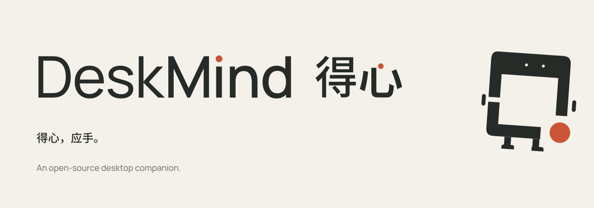
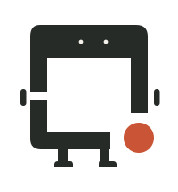
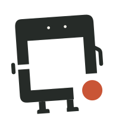

<p align="center">
  <picture>
    <source media="(prefers-color-scheme: dark)" srcset="assets/brand/banner-dark.svg">
    
  </picture>
</p>

<p align="center">
  <a href="LICENSE"></a>
  <a href="https://huggingface.co/deskmind"></a>
  
  
  <a href="docs/results.md"></a>
</p>

<p align="center">
  <b>DeskMind Brain</b> · Typed, calibrated step decisions for computer-use agents, running on your own Mac.<br>
  <a href="README.zh-CN.md">中文</a> · <a href="docs/results.md">Results</a> · <a href="docs/training.md">Training</a>
</p>

---

**DeskMind · 得心** — *得心，应手。* (from 得心应手: what the mind decides, the hand carries out) is a family of open-source
projects that let an agent **see** your screen, **decide** the next step, and **act** on the real desktop, all locally.

This repository is the **Brain**. It is a pair of small models that answer typed questions and return probabilities
instead of free text:
- *Which operation next?*
- *Which element?*
- *Is the goal already met?*
- *Should I ask the user first?*

| | Repository | Role |
|---|---|---|
| 👁 | [deskmind-ai/eyes](https://github.com/deskmind-ai/eyes) | find the target on a screenshot |
| 🧠 | **deskmind-ai/brain** | decide the next step, with calibrated confidence |
| ✋ | [deskmind-ai/hands](https://github.com/deskmind-ai/hands) | drive the real macOS desktop |
| 📐 | [deskmind-ai/bench](https://github.com/deskmind-ai/bench) | sandbox desktop tasks and graders to reproduce our numbers |

## What it does

- **Typed questions in, calibrated probabilities out.** Choice, yes/no and score questions are read from answer-letter
  logits only, no decoding: nothing is generated or parsed, and the probabilities sum to 1 by construction.
- **Local first.** Serving uses MLX on Apple Silicon, and by default your screen never leaves your machine. The
  router's escalation tier can be pointed at a remote server (for example a cloud API); if you do that, that tier sees
  the requests it is sent.
- **Drop-in API.** `POST /v1/systemone` takes `{state, questions}` and returns `{answers}`, the same shape as System
  One–style decision APIs, so an existing client only changes its base URL.
- **Two tiers.** The 0.8B model answers by default. When it is unsure, or when a step is costly to get wrong (finishing
  a task, undoing work, unusual shortcuts), `scripts/router_serve.py` hands the step to the 4B model.

## Results (October 2026, release G18b)

Real macOS desktop, 13 sandbox tasks × 3 runs, strict pass, on
[deskmind-ai/bench](https://github.com/deskmind-ai/bench) v25, run through the DeskMind app on an M4 Pro:

| | pass | false "done" | decision time (p50) |
|---|---|---|---|
| **DeskMind router G18b** (0.8B → 4B, 8-bit, threshold 0.96) | **39/39** | **0** | 0.48 s when the 0.8B answers, 3.6 s when the 4B checks (about 70% of steps) |
| DeskMind router G14 (earlier release) | 36/39 | 0 | 0.57 s |

On the earlier suite v23, the G14 router passed 35/38 (92%) and Jev (TypeSafe, cloud) 33/38 (87%); there is no Jev
run on v25. JevBench v1.4.2, 231 public items (the board's `public_accuracy` column): G18b 4B **0.835**, G14 4B 0.866.
The board's headline JevBench Score (0–100) also weighs sealed items, calibration, speed and cost; we have not been
scored on the sealed set yet. Details: [docs/results.md](docs/results.md).

**Known gaps:**
- **Speed:** the G18b 0.8B is confident in a narrow band, so most steps go to the 4B and a typical decision takes about
  3 s; the next round aims to widen the fast path.
- **General judgement:** G18b's 4B lost ground on JevBench's hard tier (85 → 76 of 111) while it gained on the real
  desktop.
- **Saying "done":** on one task (Chinese exact text) the file was right but the model kept going until the step
  budget ran out.

Method and full tables: [docs/results.md](docs/results.md).

## Quick start

```bash
uv sync --extra mlx
uv run hf download deskmind/brain-4b --revision g18b-q8 --local-dir models/brain-4b
uv run deskmind-brain-serve --predictor mlx:models/brain-4b --port 8793 --two-stage
curl -s localhost:8793/v1/systemone -H 'Content-Type: application/json' -d @examples/request.json
```

`examples/request.json` is a real step from a sandbox Finder task: the page state plus the questions for the operation
and its targets.

The 4B is 4.2 GB to download and the 0.8B 0.8 GB. If `hf download` fails with a `CAS Client Error` (the Xet transfer
path), retry with `HF_HUB_DISABLE_XET=1` in front of the command. In mainland China, ModelScope carries the same files:
`uvx modelscope download --model gxcsoccer/brain-4b --local-dir models/brain-4b` (and `gxcsoccer/brain-0.8b`).

Two-tier serving in one process (the 0.8B answers, and risky or unsure steps go to the 4B):

```bash
uv run hf download deskmind/brain-0.8b --revision g18b-q8 --local-dir models/brain-0.8b
uv run deskmind-brain-serve --predictor mlx:models/brain-0.8b --escalate-to mlx:models/brain-4b \
  --two-stage --port 8796
```

The routing threshold comes with the weights (`router_threshold` in the 0.8B's `deskmind.json`, 0.96 for G18b);
`--threshold` overrides it.

Each reply carries a `routing` record: who answered, and why. The tiers can also run as separate servers, with the 0.8B
on 8794 and the 4B on 8793: `uv run python scripts/router_serve.py --fast http://127.0.0.1:8794 --strong http://127.0.0.1:8793
--keep-done-over-undo --port 8796`.

## Models

| Model | Base | Licence |
|---|---|---|
| `deskmind/brain-0.8b` | Qwen3.5-0.8B + LoRA (merged) | Apache-2.0 |
| `deskmind/brain-4b` | Qwen3.5-4B + LoRA (merged) | Apache-2.0 |

Each model directory carries a `deskmind.json` with the prompt format it was trained with.

## Training

See [docs/training.md](docs/training.md). It covers:
- desktop DAgger with an oracle;
- counterexamples for label shortcuts;
- LoRA distillation with KL to teacher distributions;
- the prompt format and two-stage serving.

## Brand

The frame is your desk. The orange point is a decision, placed carefully. The mascot is **Xiaofang (小方)**, the frame
come to life. Assets are in [`assets/brand`](assets/brand).

<p>
  
  
  
  
</p>

## License

Code and weights are licensed Apache-2.0. The DeskMind name, 得心, the logo and Xiaofang are not covered by the code
licence. You may use them to refer to the project, but not in modified form or to imply endorsement.
